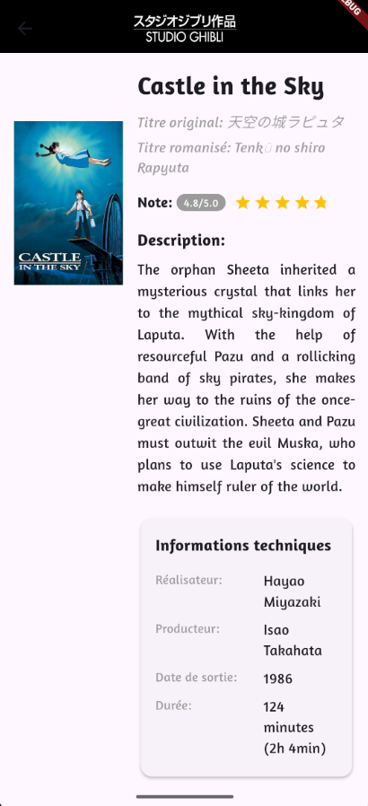
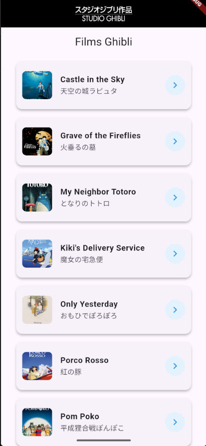

# 🎬 Détail d’un film – Évaluation Flutter

Ce projet Flutter a pour objectif de présenter **l’affichage des détails d’un film** à partir de son identifiant (`id`) avec une interface organisée, une note en étoiles et quelques fonctionnalités interactives.

## 🔎 Fonctionnement

Lorsqu’un `id` de film est passé au widget `MovieWidget`, les données correspondantes sont récupérées via un appel à l’API (dans `MoviesApiServices`). Une fois le film trouvé, les informations suivantes sont affichées :

* `title`
* `original_title`
* `original_title_romanised`
* `image`
* `description`
* `director`
* `producer`
* `release_date`
* `running_time`

L’interface est organisée en **deux colonnes** :

* 📸 À gauche : l’image du film
* 📝 À droite : toutes les informations textuelles, la note et la description

---

## ⭐ Affichage de la note (rt\_score)

La note du film (`rt_score`, notée sur 100) est convertie en note sur 5 pour une meilleure lisibilité visuelle. Cette conversion est effectuée de la façon suivante :

```dart
(double.parse(rt_score) / 100) * 5
```

La bibliothèque [flutter\_rating\_stars](https://pub.dev/packages/flutter_rating_stars) est utilisée pour afficher la note sous forme d’étoiles.

➡️ La note est également affichée en texte sous le format `x/5`.

---

## 🖼️ Affichage de l'image en grand

Lorsque l'utilisateur **clique sur l’image du film**, une **popup** s’ouvre affichant :

1. La **bannière** du film (`movie_banner`), s’il est disponible
2. En dessous, l'image principale en grand format
3. Un **défilement automatique** est effectué dans la popup pour afficher le banner

Cela permet d’explorer les visuels du film de manière plus immersive.

---

## ⏱️ Conversion de la durée

Le champ `running_time` (durée en minutes) est affiché de deux manières :

```text
Exemple : 124 minutes (2h 4min)
```

La conversion est faite automatiquement pour plus de clarté.

---

## 🧪 Exemple d’utilisation

Pour afficher un film, il suffit d’appeler le widget :

```dart
MovieWidget(id: "2baf70d1-42bb-4437-b551-e5fed5a87abe")
```

L’id est celui renvoyé par l’API du studio Ghibli.

---

## ✅ Résumé des fonctionnalités

* ✔️ Affichage des informations complètes du film à partir de son ID
* ✔️ Note en étoiles avec conversion de rt\_score (/100 → /5)
* ✔️ Popup interactive avec image en grand + banner
* ✔️ Affichage clair de la durée (minutes + format heures)
* ✔️ Interface en deux colonnes, responsive et lisible

Détails d'un film


Page d'acceuil


autheur : [TABAR LABONNE Baptiste](https://github.com/TabarBaptiste)
